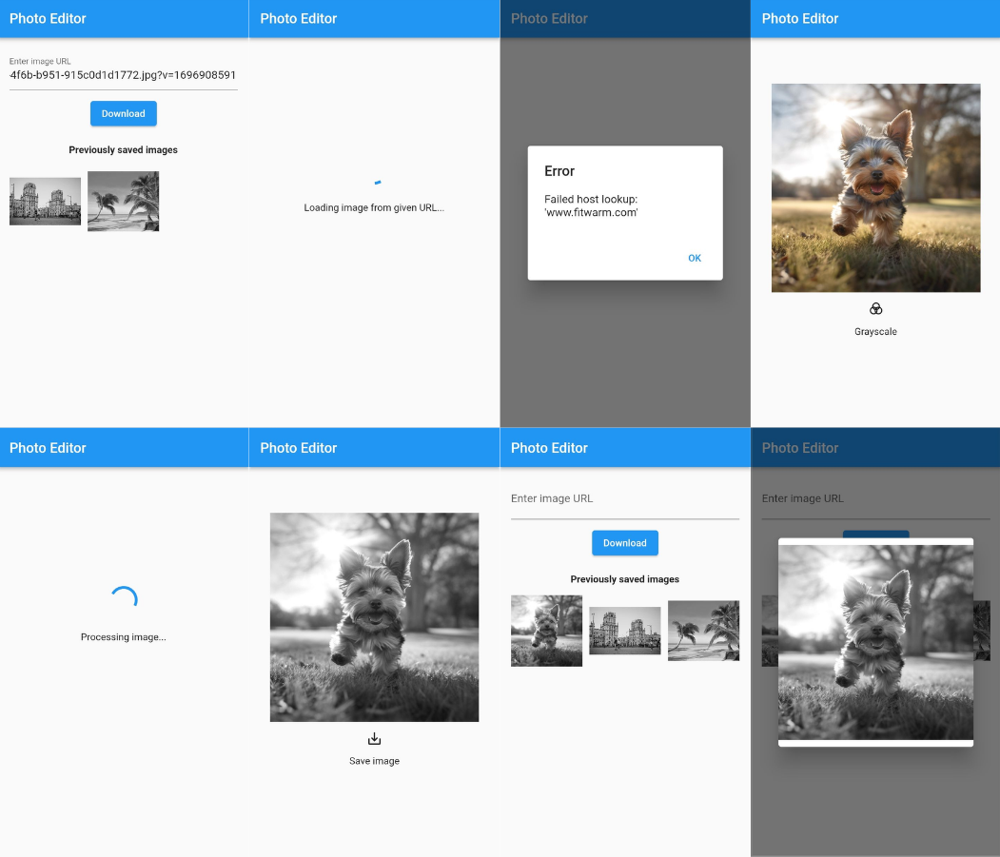

# Photo Editor

Данное приложение позволяет загружать изображения с заданного URL, обрабатывать его (преобразовывать в оттенки серого) и сохранять в память устройства.
Также доступна возможность просмотра ранее загруженных изображений. Для пользователя отображаются все состояния приложения, в том числе сообщения о возникающих ошибках.



## Используемые технологии

- http: Для выполнения HTTP запросов был использован пакет http.
- image: Для обработки изображения был использован пакет image. В качестве преобразования был выбран метод grayscale(), выполняющий преобразование изображения в оттенки серого. Также использовался класс Command при обработке изображения, для создания цепочки команд и ее асинхронного выполнения.
- SharedPreferences: Пути изображений сохраняются в SharedPreferences.
- BLoC: Для реализации State Management был использован BLoC.

## Установка

Необходимо склонировать репозиторий используя команду:

```
git clone https://github.com/AnastasiaGolyuk/photo_editor.git
```

Далее следует перейти в директорию склонированного репозитория:

```
cd photo_editor
```

Теперь необходимо установить все зависимости. Для этого требуется выполнить следующую команду:

```
flutter pub get
```

Чтобы запустить приложение, следует убедиться, что устройство, на котором Вы хотите его запустить подключено и выполните команду:

```
flutter run lib/main.dart
```
